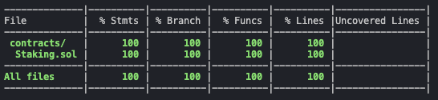

# Simple staking app using React, Ethers and hardhat
This is a basic project with the only pupose to test development environnement composed of react/typescript/solidity/ethers/hardhat

## Smart contract
Smart contract is in `./hardhat`

It's fully tested : 

## Front end
Basic one just for test interaction with front end using ethers

## How to use it
In `./hardhat`:

- Launch local blockchain with `npx hardhat node`
- Compile the contract with `npx hardhat compile`
- Deploy the contract on the local blockchain with `npx hardhat --network localhost run scripts/deploy.ts`

Then in `./client` :

- Run `npm start`
